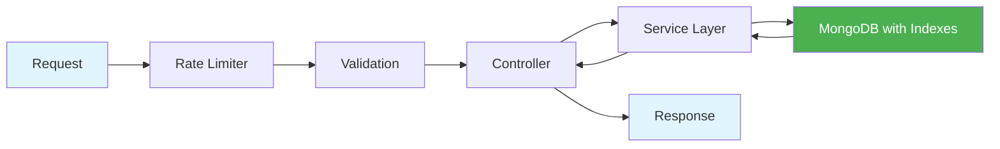

<div align="center">

# 🚀 RealWorld API

### _Production-Ready REST API with Node.js, TypeScript & MongoDB_

[](https://www.typescriptlang.org/)
[](https://nodejs.org/)
[](https://expressjs.com/)
[](https://www.mongodb.com/)
[](https://jwt.io/)

**A fully spec-compliant [RealWorld](https://realworld-docs.netlify.app/) API implementation**

[Features](#-features) • [Quick Start](#-quick-start) • [API Docs](#-api-documentation) • [Architecture](#-architecture) • [Security](#-security)

---

</div>

## ✨ Features

<table>
<tr>
<td width="50%">

### 🔐 Authentication & Users
- ✅ JWT-based auth (stateless)
- ✅ Bcrypt password hashing
- ✅ User registration & login
- ✅ Profile management
- ✅ Follow/unfollow system

</td>
<td width="50%">

### 📝 Articles & Content
- ✅ CRUD operations
- ✅ Auto-generated slugs
- ✅ Image support
- ✅ Tag-based categorization
- ✅ Markdown/HTML content

</td>
</tr>
<tr>
<td width="50%">

### 💬 Interactions
- ✅ Like/unlike articles
- ✅ Favorite/unfavorite
- ✅ Bookmark system
- ✅ Comment threads
- ✅ Share tracking

</td>
<td width="50%">

### 🎯 Discovery & Feeds
- ✅ Global article list
- ✅ Personalized feed
- ✅ Tag filtering
- ✅ Author filtering
- ✅ Pagination & sorting

</td>
</tr>
</table>

---

## 🛡️ Security

<div align="center">

| Feature | Implementation | Status |
|---------|---------------|--------|
| **Authentication** | JWT with configurable expiration | ✅ |
| **Password Security** | Bcrypt (10 salt rounds) | ✅ |
| **Input Validation** | Zod schemas | ✅ |
| **Rate Limiting** | 100 req/15min per IP | ✅ |
| **Security Headers** | Helmet middleware | ✅ |
| **CORS** | Configurable origins | ✅ |
| **Authorization** | Role-based access control | ✅ |

</div>

---

## ⚡ Performance



### 🚄 Optimizations
- **Database Indexes** - Fast queries on slug, author, dates
- **Efficient Pagination** - Limit/offset with total counts
- **Smart Populate** - Load related data only when needed
- **Auto-calculated Fields** - Read time, counts
- **Sorted Queries** - Index-backed sorting

---

## 🏗️ Architecture

```
┌─────────────────────────────────────────────────────────┐
│                     Express App                          │
├─────────────────────────────────────────────────────────┤
│  Security: Helmet, CORS, Rate Limiting                  │
├─────────────────────────────────────────────────────────┤
│                      Routes Layer                        │
│  ┌──────────┬──────────┬──────────┬──────────┐         │
│  │  Users   │ Profiles │ Articles │ Comments │         │
│  └──────────┴──────────┴──────────┴──────────┘         │
├─────────────────────────────────────────────────────────┤
│                   Middleware Layer                       │
│  ┌──────────┬──────────┬──────────┬──────────┐         │
│  │   Auth   │ Validate │  Error   │  Logger  │         │
│  └──────────┴──────────┴──────────┴──────────┘         │
├─────────────────────────────────────────────────────────┤
│                  Controllers Layer                       │
│         (Thin handlers for request/response)            │
├─────────────────────────────────────────────────────────┤
│                   Services Layer                         │
│           (Business logic & orchestration)              │
├─────────────────────────────────────────────────────────┤
│                    Models Layer                          │
│  ┌──────────┬──────────┬──────────┐                    │
│  │   User   │ Article  │ Comment  │                    │
│  └──────────┴──────────┴──────────┘                    │
├─────────────────────────────────────────────────────────┤
│                      MongoDB                             │
│         (Indexes, Middleware, Virtuals)                 │
└─────────────────────────────────────────────────────────┘
```

---

## 🚀 Quick Start

### Prerequisites

```bash
Node.js 18+  |  MongoDB  |  pnpm
```

### Installation

```bash
# 1️⃣ Install dependencies
pnpm install

# 2️⃣ Configure environment
cp .env.example .env
# Edit .env with your MongoDB URI and JWT secret

# 3️⃣ Seed database (optional but recommended)
pnpm seed

# 4️⃣ Start development server
pnpm dev

# 🎉 Server running at http://localhost:3000
```

### 🧪 Test Credentials

After running `pnpm seed`:

| Email | Password | Role |
|-------|----------|------|
| `john@example.com` | `password123` | User |
| `jane@example.com` | `password123` | User |
| `bob@example.com` | `password123` | User |

---

## 📚 API Documentation

### 🌐 Interactive Swagger UI

Visit **[http://localhost:3000/api-docs](http://localhost:3000/api-docs)** for interactive API documentation

<div align="center">

### 📍 Endpoints Overview

</div>

<details>
<summary><b>🔐 Authentication</b></summary>

```http
POST   /api/users              # Register new user
POST   /api/users/login        # Login existing user
GET    /api/user               # Get current user (auth)
PUT    /api/user               # Update user (auth)
```

</details>

<details>
<summary><b>👤 Profiles</b></summary>

```http
GET    /api/profiles/:username           # Get user profile
POST   /api/profiles/:username/follow    # Follow user (auth)
DELETE /api/profiles/:username/follow    # Unfollow user (auth)
```

</details>

<details>
<summary><b>📝 Articles</b></summary>

```http
POST   /api/articles              # Create article (auth)
GET    /api/articles/:slug        # Get single article
PUT    /api/articles/:slug        # Update article (auth, author only)
DELETE /api/articles/:slug        # Delete article (auth, author only)
GET    /api/articles              # List articles (supports filtering)
GET    /api/articles/feed         # Get personalized feed (auth)
```

**Query Parameters for List:**
```
?tag=nodejs          # Filter by tag
?author=johndoe      # Filter by author
?favorited=janedoe   # Filter by favorited user
?limit=20            # Pagination limit
?offset=0            # Pagination offset
```

</details>

<details>
<summary><b>❤️ Interactions</b></summary>

```http
POST   /api/articles/:slug/favorite      # Favorite article (auth)
DELETE /api/articles/:slug/favorite      # Unfavorite article (auth)
POST   /api/articles/:slug/like          # Like article (auth)
DELETE /api/articles/:slug/like          # Unlike article (auth)
POST   /api/articles/:slug/bookmark      # Bookmark article (auth)
DELETE /api/articles/:slug/bookmark      # Unbookmark article (auth)
POST   /api/articles/:slug/share         # Track share
GET    /api/articles/bookmarked/list     # Get bookmarked articles (auth)
```

</details>

<details>
<summary><b>💬 Comments</b></summary>

```http
POST   /api/articles/:slug/comments       # Add comment (auth)
GET    /api/articles/:slug/comments       # Get all comments
DELETE /api/articles/:slug/comments/:id   # Delete comment (auth, author only)
```

</details>

<details>
<summary><b>🏷️ Tags</b></summary>

```http
GET    /api/tags                          # Get all tags
```

</details>

---

## 🎨 Response Format

All responses follow consistent envelope patterns:

### Single Resource
```json
{
  "user": {
    "username": "johndoe",
    "email": "john@example.com",
    "bio": "Full-stack developer",
    "image": "https://example.com/avatar.jpg",
    "token": "eyJhbGciOiJIUzI1NiIsInR5cCI6IkpXVCJ9..."
  }
}
```

### Collection Resource
```json
{
  "articles": [
    {
      "slug": "how-to-build-apis-abc123",
      "title": "How to Build APIs",
      "description": "A comprehensive guide",
      "body": "Full article content...",
      "tagList": ["nodejs", "api"],
      "createdAt": "2024-01-15T10:30:00.000Z",
      "favorited": false,
      "favoritesCount": 5,
      "author": { "username": "johndoe", "following": false }
    }
  ],
  "articlesCount": 42
}
```

### Error Response
```json
{
  "errors": {
    "body": ["Error message here"]
  }
}
```

---

## 📦 Tech Stack

<div align="center">

| Category | Technology |
|----------|-----------|
| **Runtime** | Node.js 18+ |
| **Language** | TypeScript 5.3 |
| **Framework** | Express.js 4.18 |
| **Database** | MongoDB 8.0 + Mongoose |
| **Authentication** | JWT (jsonwebtoken) |
| **Validation** | Zod 3.22 |
| **Security** | Helmet, CORS, bcrypt, rate-limit |
| **Logging** | Pino (high-performance) |
| **Documentation** | Swagger UI + OpenAPI 3.0 |
| **Package Manager** | pnpm |

</div>

---

## 📂 Project Structure

```
src/
├── 📁 config/           # Database & environment configuration
├── 📁 controllers/      # Request handlers (thin layer)
├── 📁 routes/           # Route definitions with middleware
├── 📁 models/           # Mongoose schemas with methods
├── 📁 services/         # Business logic layer
├── 📁 middleware/       # Auth, validation, error handling
├── 📁 utils/            # JWT, slugify, logger utilities
├── 📁 validators/       # Zod validation schemas
├── 📁 swagger/          # OpenAPI documentation
├── 📁 seeds/            # Database seed script
├── 📁 types/            # TypeScript type definitions
├── 📄 app.ts            # Express app setup
└── 📄 server.ts         # Server entry point
```

---

## 🔧 Environment Variables

```env
NODE_ENV=development              # Environment (development/production)
PORT=3000                         # Server port
MONGODB_URI=mongodb://...         # MongoDB connection string
JWT_SECRET=your-secret-key        # JWT signing secret (change in production!)
JWT_EXPIRES_IN=7d                 # Token expiration time
```

---

## 🧪 Testing & Development

### Seed Database
```bash
pnpm seed
```
Creates 3 users, 5 articles, comments, and relationships for testing.

### Development Mode
```bash
pnpm dev
```
Runs with hot-reload using `tsx watch`.

### Production Build
```bash
pnpm build
pnpm start
```

---

## 🚢 Deployment

### Recommended Platforms

<div align="center">

| Platform | Difficulty | Free Tier |
|----------|-----------|-----------|
| **Render** | ⭐ Easy | ✅ Yes |
| **Railway** | ⭐ Easy | ✅ Yes |
| **Heroku** | ⭐⭐ Medium | ✅ Yes |
| **DigitalOcean** | ⭐⭐ Medium | ❌ No |
| **AWS/GCP/Azure** | ⭐⭐⭐ Advanced | ✅ Yes (limited) |

</div>

### Deployment Checklist

- [ ] Set `NODE_ENV=production`
- [ ] Use strong `JWT_SECRET`
- [ ] Configure MongoDB Atlas or managed database
- [ ] Set up environment variables
- [ ] Enable HTTPS
- [ ] Configure CORS for your domain
- [ ] Set up monitoring and logging

---

## 📖 Additional Documentation

| Document | Description |
|----------|-------------|
| `API_FEATURES.md` | Complete feature list with examples |
| `IMPLEMENTATION_CHECKLIST.md` | Detailed implementation guide |
| `SECURITY_PERFORMANCE_CHECKLIST.md` | Security & performance details |

---

## 🎯 What Makes This Special?

<table>
<tr>
<td width="33%" align="center">

### 🏆 Production-Ready
Enterprise-grade security, performance, and error handling

</td>
<td width="33%" align="center">

### 📚 Well-Documented
Swagger UI, detailed README, and inline comments

</td>
<td width="33%" align="center">

### 🧪 Testable
Seed data, consistent API, and proper error responses

</td>
</tr>
<tr>
<td width="33%" align="center">

### 🎨 Clean Code
Layered architecture with separation of concerns

</td>
<td width="33%" align="center">

### ⚡ Performant
Optimized queries, indexes, and efficient pagination

</td>
<td width="33%" align="center">

### 🔒 Secure
JWT auth, bcrypt, rate limiting, and input validation

</td>
</tr>
</table>

---

## 🤝 Contributing

This is a portfolio/learning project implementing the [RealWorld spec](https://realworld-docs.netlify.app/). Feel free to fork and customize!

---

## 📄 License

MIT License - feel free to use this project for learning or as a starting point for your own API!

---

<div align="center">

### 🌟 If you found this helpful, give it a star!

**Built with ❤️ using Node.js, TypeScript, Express, and MongoDB**

[⬆ Back to Top](#-realworld-api)

</div>
